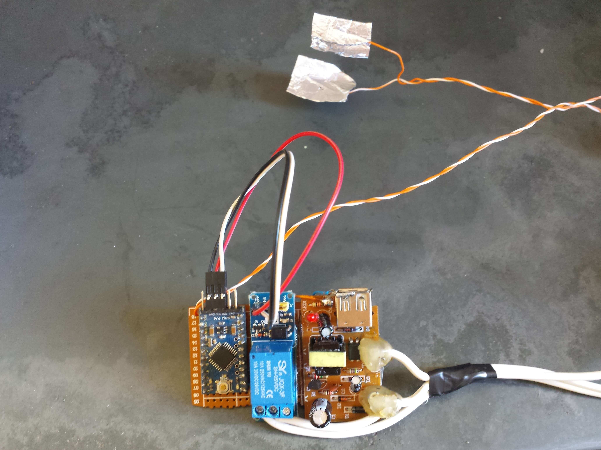
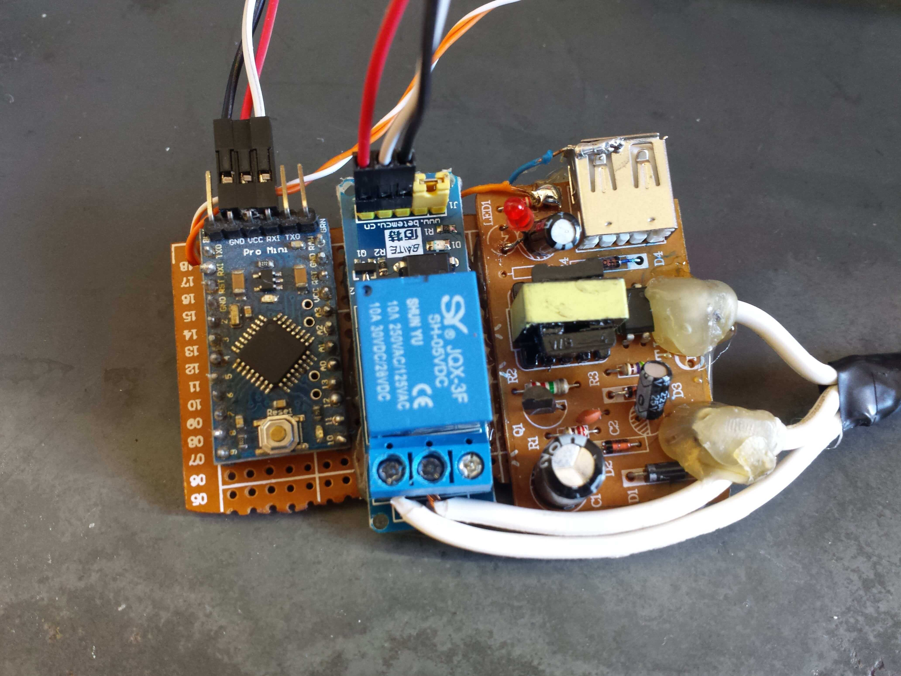

# Bathroom-Lamp
A tiny little Arduino project to control the light bulb of a Bathroom.

##### The goal of this project is to eliminate the energy waste when people leaves the bathroom leaving the light bulb ON.

There is a sensor in the door to tell when the door is open or close. The microcontroller will then turn the lamp down when the door is open and turn the lamp on when the door is closed.

## Main Components

* An [Arduino© Pro Mini](https://www.arduino.cc/en/Main/ArduinoBoardProMini) 16MHz 5V
* A Relay module
* Two aluminium foil (to act as a sensor on the door)  
    *(The ideal sensor is one that can tell when there's people in the bathroom and when there's not.)*
* A cellphone charger (5V output)

## The Circuit

The wires with AC voltage that were originally wired to the light bulb were removed and connected in the cellphone charger input. The output were soldered into the input (Vin) of the Arduino and the Relay module.
One of the AC wires was connected back in the light bulb. The other was connected as well, but through the Relay, so the Relay can act like as the switch. The relay "In1" pin was connected to one of the digital I/O pins of the Arduino.
The sensor in the door are just two little foils of aluminium. One of the foils was placed in the door, close to the door's hinge. The other was placed in the doorway, next to the other part of the door's hinge in a way that when the door is closed, the two foils come together. Both foils were connected to digital I/O pins of the Arduino through wires. Therefore I can use this "sensor" in the Arduino program like an ordinary pushbutton.

*TODO: Put a graphic scheme of the circuit here*

## The Algorithm

As the section above describes the circuit, you can see that the original switch can be used to turn the whole circuit on and off. This makes possible to the light bulb be turned on and off with the original switch. To allow that, once the microcontroller is on, it turns on the light bulb and let it stay on for 5 minutes if the door is open. If someone close the door before the timeout is over, then the light will be turned off once the door is opened. So, to turn on the light with the door open (for any reason), just switch the original light bulb switch off and then on.

## Compiling

* First install [PlatformIO Core](http://docs.platformio.org/en/latest/installation.html#installation-methods) or [PlatformIO IDE (Atom Editor)](http://docs.platformio.org/en/latest/ide/atom.html).
* Connect the arduino or compatible microcontroller to the computer.
* In a terminal/shell, go to the project directory and type ``pio run -t upload``

More information and options about compiling a PlatformIO project [here](http://docs.platformio.org/en/stable/userguide/cmd_run.html).

## Observations

If you got interested in this project and want to replicate it, or better yet, to make improvements, feel free to do so!
If you are gonna use other board/microcontroller, you just need to change the [platformio.ini](https://github.com/saviocmc/Bathroom-Lamp/blob/master/platformio.ini) file, putting there your board model and framework. Take a look at [PlatformIO](http://platformio.org), it's great.

The sensor of aluminum foil was the most cheap and easy way that I found to get this thing working. The ideal sensor is one that can tell when there's people in the bathroom and when there's not. If you can think in something better, please suggest it here (you can [open an issue](https://github.com/saviocmc/Bathroom-Lamp/issues) or something). I thought in [Lasers](https://wikipedia.org/wiki/Laser_pointer) and [PIR sensors](https://wikipedia.org/wiki/Passive_infrared_sensor), but I couldn't find a really efficient way to use them.

## Images of the circuit (ready to be used) that I built

